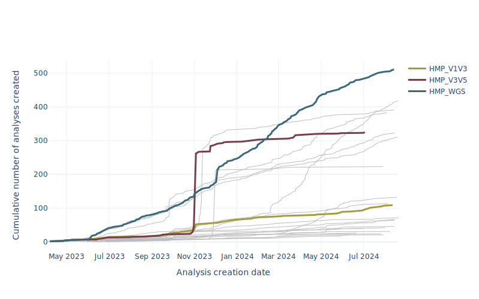

# mbiodb-site-usage
Analysis of MicrobiomeDB.org usage


This repo can be used to generate figures that show particular usage statistics for the MicrobiomeDB.org website. 




## Getting started

### 0. Install python >=3.11
Use ```brew install python``` to get the latest version, or 

```brew install python@3.11```

for the version I used.

### 1. Specify environment variables
Ensure the following variables are specified in a `.env` file. For convenience, copy the `.env.sample` file to `.env` and update the values.

<!-- Table of variables -->
| Variable | Description |
|----------|-------------|
| DB_USER     | database user name |
| DB_PASSWORD     | database password |
| HOST     | host, example "localhost" |
| PORT     | port |
| DATABASE     | Database name |
| REMOVE_IDS     | User IDs that should be removed from the analysis. For example, exclude staff. |


### 2. SSH to server
Next, ssh into the server on which your database resides

### 3. Prepare python env

3a. Create a new python environment for the project. In the terminal, run

```python3 -m venv env```

which will create a new directory called `env`. 

3b. Activate the environment with

```source env/bin/activate ```

3c. Install required packages using

```pip install -r requirements.txt```


### 4. Run the notebook
As long as the variables are specified correctly in `.env`, running the jupyter notebook should be hassle-free. Note that all SQL queries are MicrobiomeDB-specific.


### 5. Deactivate the environment
When finished, deactivate your python environment by running 
```deactivate``` in the terminal.

